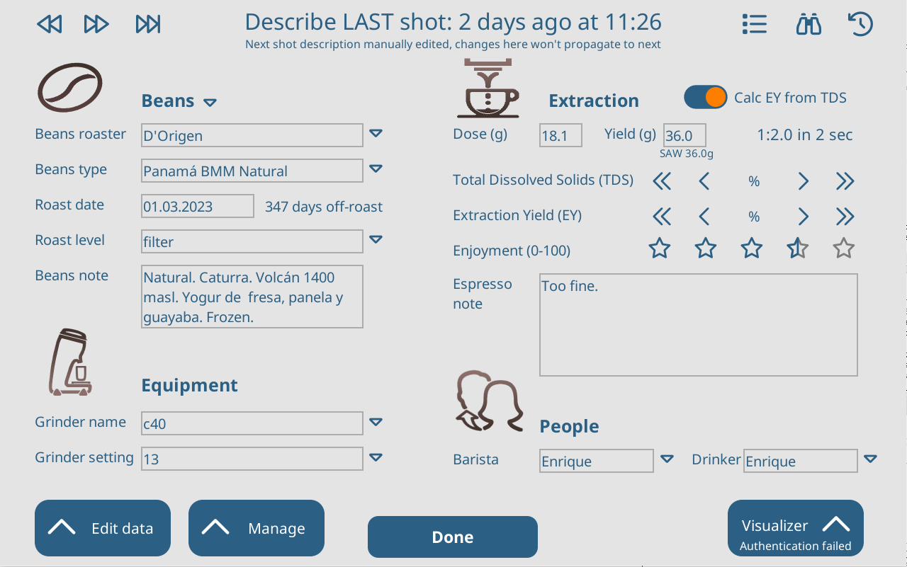

# Describe Your Espresso Overview and Redesign
  **By Enrique Bengoechea**
  **v1, 13 Feb 2024**

Describe Your Espresso (DYE) is an open-source third-party extension/plugin for the [Decent DE1 application](https://github.com/decentespresso/de1app), developed by Enrique Bengoechea.

## History

DYE started in 2020 as an improved way of logging additional coffee shots metadata that the DE1 app didn’t really handle. The main DE1 app and the skins available at the time only exposed data directly handled by the machine hardware (pressures, flows, temperatures, etc.), but barely considered any additional information that, for the user, can be equally (or more!) relevant for espresso making, such as beans, grinder, or dose/yield ratio. The Insight skin had a page for almost the same data as DYE includes still today (as of 2024). It was the base of the first DYE version, but it was not very accessible and quite limited in scope.

At the time, the main app didn’t even support plugins, so DYE started as a [DSx skin plugin](https://github.com/ebengoechea/dye_de1app_dsx_plugin). Only later, when Johanna introduced extensions in the main app, DYE became a base app plugin. Development of DYE required several new technical capabilities that the base app didn’t provide, such as a shot history SQL database, a declarative metadata dictionary, more powerful GUI elements, or improved integration with Miha Rekar’s Visualizer cloud service. While initially included inside DYE, those were with time split off into its own components: the [Shot DataBase (SDB) plugin](https://github.com/ebengoechea/de1app_plugin_SDB), the [DUI](https://github.com/decentespresso/de1app/blob/main/documentation/decent_user_interface.md) and [metadata](https://github.com/decentespresso/de1app/blob/main/de1plus/metadata.tcl) packages that are now part of the base app, and parts of what now is the [Visualizer upload](https://github.com/decentespresso/de1app/tree/main/de1plus/plugins/visualizer_upload) plugin (maintained by Johanna).

As a third-party optional extension, DYE has been a tool for new ideas and ways of interacting with the DE1. New unexpected venues has been explored stemming both from my own interests and from users’ suggestions, creating a tool that in some ways is quite different from how it started. In that sense, DYE now offers capabilities that go well beyond “mere data logging”, such as shot history management, beans-based dial-in workflow, or profile tools.

During most part of 2022 and 2023 DYE development halted. The publication of Damian’s new [DSx2 skin](https://github.com/Damian-AU/DSx2) incentivized me to come back and try new ideas that I had had in mind for a while, such as Favorites and Source shots, and that have triggered the desire for a redesign.

## Base concept

Typing data in a tablet screen on top of your espresso machine is… not that comfortable. Most of us bother to do it not just for the data logging, but because having that data at hand is extremely useful for dialling-in future shots. Either the immediately forthcoming shots, or any shots in the future that happen to use the same beans, or the same profile, or the same grinder.

In the beginning, DYE focused merely on facilitating the data entry process. But, with time, it became more and more a power workflow tool around shots, beans, and dialling-in. Acknowledging this should be at the core of its evolution.

DYE aspires to erase the boundaries between data that is handled by the hardware (pressure, flow, or temperature) and data that is outside the machine (beans, dose and yield, grinder, extraction or people). For the user, all can be equally relevant for preparing espresso, and, unlike most skins historically, DYE tries to present them all at the same level.

## Workflow and dialling-in: The propagation mechanism

At the core of DYE is the propagation mechanism. This is the virtual equivalent of iterative dialling-in. Whenever changing beans (or, to a lesser extent, profile or grinder, or some other parameter) you make an initial guess as to what the best profile, ratio or grinder setting may be. Espresso is prepared, tasted, and small iterative adjustments are made on each subsequent shot to improve it. Often the subsequent shot with the same beans (and/or grinder, and/or profile, etc.) is also the next shot in time. But it also happens that it is several shots, days, or even months away. DYE is there to facilitate retrieving all the data you generated for that last shot with he same beans (and/or blah blah blah) into the environment and be able to replicate it perfectly, or modify what didn’t work that well.

It is this aspect of DYE that was totally neglected in the base app when DYE development started. Despite having a fancy machine and tablet, lots of data, and saving all shots made, the base app didn’t provide any way whatsoever to access, analyze or use that historical data.

The initial versions of DYE only propagated data from one shot to the immediate next (provided propagation is enabled in the DYE settings page). This data propagates even after making the shot. If you modify the last shot in retrospective, those changes auto-propagate to the next shot. At least, until you modify the next shot definition manually, at that point the propagation from last-to-next will stop (whether this has happened is reflected in the UI by a “*” on the Next shot description (DSx and DSx2 only), and by a descriptive subtitle in the Last and Next DYE pages).

This mechanism works well if you consume one bag of beans after another. But what if you have several bags open, and frequently swap beans? Or if you get a new batch of the same type of beans you already used in the past, with a new roaster date? For these cases DYE provides 2 functions, accessible from the “Edit data…” button pop-up menu:

  * **A “push” mechanism**: navigate to any past shot, then launch “Copy to Next shot....” to copy/propagate all or part of its data to the Next shot definition.
  * **A “pull” mechanism**: navigate to the Next shot, then launch “Read from selected shot…” to open a shot selection dialog and pull all or part of its data to the Next shot.
 
The user can select  which data to copy from the past to the Next shot using the checkboxes on top of the “Edit data…” dialog.

While powerful, these two functions became tedious to use when switching beans often. To tackle this, DYE recently introduced the “Recent Favorites” (only available with the DSx2 skin at the moment). The nth favorite shows the last nth beans (or beans+profile+grinder+workflow, this combination being definable by each user ) used, and selecting it propagates to the Next shot all or part of the parameters of the last shot that was made with those beans. It also flags the original shot as the “source” shot of the next shot, and shows its graph on the DSx2 skin home page. So that everything in the environment works as it that original shot was exactly the latest shot just made with the DE1. The list of “Recent Favorites” updates automatically when a new espresso is made, and is shown on the home page. Thus, this feature allows one-tap instant update of the environment to all the exact parameters you used when you last made espresso with the beans that you’re just going to use. The user can also define exactly what data should be copied when the favorite is loaded.

![Tap a DYE favorite button to change the Next shot definition and load the source shot as the last shot]
(DSx2_DYE_Load_fav_shows_source_graph.png "DYE Favorites on DSx2")

A new dialog for beans and grinder selection has recently been introduced in DYE for DSx2 that also allows total or partial propagation: when selecting beans the user can choose to propagate the last shot made with those beans, and when selecting grinder the user can choose to fill the grinder setting with the last value used with the same beans (if available, otherwise whatever the last setting was).

### Shot comparison for dialling-in

One of the most powerful helpers for dialling-in beans is to know exactly what parameters have been changed from shot to shot. This is something that DYE currently facilitates but quite more can be done, and this should be one focus of future developments.

The easiest way to allow this is to show the descriptions of both the next and the last or source shot on parallel so they can be compared manually. This is done on both DSx and DSx2 skins home pages, but not on other skins, which only integrate DYE with a launch button. This is in fact the main reason why DYE is so much more useful under DSx/DSx2 than under other skins.

One key part of shot parameters that is not directly managed by DYE is the profile. Apart from changing the profile, making minor modifications to a profile for a given shot is a part of the dialling-in process, and, in the default DE1 app, these changes are easily lost, because they can be saved or not, and there’s no way to retrieve what was changed for a given shot. That’s why DYE introduced its own Profile Viewer dialog, which shows a novel text description of any profile (either profiles saved to disk, or the actual profile specifically modified on a given shot) and highlights its differences with any other profile.

A “comparison mode” that explicitly shows all the differences between the next and the source shot has always been a desired feature for DYE but has not been implemented yet (except for profiles). In an ideal world, this mode should also show a compared graph of the shots, and allow changing the main dialling-in parameters on the spot.
 

## Metadata

DYE only manages a small handful of shot metadata, with barely any change since its creation. Most of that data was already available for description in the base app and is considered just a basic set, but much more is possible. A detailed analysis of additional fields was carried out in Diaspora, ending up on [this proposal](https://3.basecamp.com/3671212/buckets/7351439/messages/3316379592#__recording_3804933033), but the new fields haven’t found its way to DYE yet, the main problem being the software UI limitations, which make it a challenge to incorporate new data for those users than want to log it, but without getting in the way for those also many users that don’t want to. But a DYE redesign should carefully considered how this could be achieved. A prototype covering this was proposed in Diaspora years ago ([DYE v3 RFC](https://3.basecamp.com/3671212/buckets/7351439/messages/3777997470)), but I wasn’t convinced so it wasn’t further developed (but other parts of that work, such as textual representations of profiles and shots, did get into DYE). A preliminary prototype for a different redesign is presented below.

A critical finding of user feedback during these years is that the metadata each user is interested in varies wildly. For example, some users don’t have a refractometer and couldn’t care less about TDS and EY, whereas others always fill it but ignore the “People” section, and so on. I find that some level of user customization of the main DYE page to accommodate this variation would be much welcomed. Both the DYE v3 RFC and the recent prototype took this into account.

DYE current main page offers an "almost complete" view of shot data, but is missing some elements that, despite not being at the core of DYE tasks, would be very useful to have there, so that DYE offers a complete view of any shot. The missing elements are the shot graph, its profile (which currently can be seen and changed from the "Manage" menu), the workflow (under DSX2) and the source shot. The proposal below includes all of these elements, but it needs to remove some current screen items to do so.

## Shot history management
Being a tool to describe and replicate any past shot, DYE needs to include shot history navigation and management tools. 

DYE conceives the shot history as a kind of "slide deck" and allows the user to move backward and forward through navigation buttons on top of the main page. Moving backwards takes you to the previous shot in time, and moving forward takes you to the next shot in time, finishing on the Next shot plan. Modifying the Next shot plan is equivalent to changing espresso parameters in the skin (for common fields, such as dose, target weight/SAW, or profile).

Direct access to specific past shots is handled by the Shot Search the Shot Selection pages. They allow querying the history database for specific shots, but were written in different moments in time and offer slightly different features. A redesign of DYE should unify them.

A common need is to find shots that match some parameter of the Next shot, normally the beans, but profile, grinder of DSx2 workflow are other typical candidates. This is explicitly offered on the Shot Selection page, and it would be nice if the default "slide deck navigator" on DYE main page also allows this.

Through the "Manage" menu, DYE also offers a couple of features that are far less used but still very useful, specially since there's no way to do it anywhere else: Shot deletion, and Shot export.

The history management tools made DYE a perfect candidate to improve integration with Miha Rekar's Visualizer cloud service. Actual automatic uploading to visualizer is managed by the Visualizer Upload plugin written and maintained by Johanna, but parts of it were originally created in DYE and later migrated to Visualizer Upload. DYE offers extra capabilites not covered by "Visualizer Upload" such as manual download and (re)upload, browse shot on Visualizer, or downloading of other users' shots or profiles.

## Profile tools
Although not so directly related to shot metadata, DYE offers 2 pages related to profile selection. These rely on the capacities offered by having a SQL database of shots to improve the experience of selecting shots (Profile Selector), plus the possibility of viewing the actual profile used in any past shot (as opposed to the last version of the same profile stored on disk) in a novel textual format, and comparing it with other profiles.

The profile comparison tools may be a good tool to be expanded to cover full shot data.

## GUI & Themes
Several new UI capabilities were first introduced in DYE, then moved to the GDUI plugin, then integrated into the main app in the DUI package. They integrated previous work from John, Barney, Johanna and Damian, and expanded it. Among those are rounded-shape buttons with several components, toggles, sliders, popup dialogs, or the theming system. DYE has served to exemplify all these new features, though many of them haven’t make their way to skins or other plugins yet.

For example, DYE is the only skin or plugin currently using DUI themes to adapt its colors (and potentially other aspects) to the skin in use. It defines a DUI theme for each skin (or skin sub-theme) it integrates with. A frequent problem with this approach is that several skins define less colors in their own theming system than DYE needs (such as colors for disabled states, or for different types of buttons). When a skin uses just one color set, it’s easier to define the extra colors directly in the DUI theme, but if the skin allows for users to define their own colors (such as MimojaCafe or DSx2), mismatches aren’t easily solved.

## 2024 Redesign objectives
DYE started as a simple tool to log data and with time it has come to offer many additional features. With its spin-offs, it also enlarged the GUI possibilities of the DE1 app. But as features and new GUI elements were added "where they fitted", its actual state shows some pages that were developed originally and never touched, mixed with more modern-looking pages, sometimes offering similar features. It lacks consistency in both GUI and functional design. 

These are my general thoughts about a redesign, some of them reflected in the preliminary prototype:

**Improved & consistent navigation through history** 

  - Merge the shot selector and the shot search pages
  - Visually join the navigation buttons (now on both left & right of top area in home page)
  - Remove link to the main app history viewer (not really finished and not really related to DYE)
  - New "Move by beans/profile/grinder/workflow" feature

**Full shot view**

  - Include graph, profile, workflow and source shot in DYE home page. To fit this, I propose:
    - Group the content in panels with a smaller header than the current one. By replacing the big images with Font Awesome icons we gain some space.
      - Remove non-essential beans data (roast level & bean note), which should still be accesible but not in the default home.
      - Remove the "Done" and menu buttons in the bottom. 
        - The menu buttons seem a bit "ad hoc", and I propose to replace them by a single menu sliding from the page left that can be open either from the "menu" button on the top left, or by swiping from the left of the tablet.
        - The "Done" button is replaced by a "back" button on the top left. This will also be used when expanding the section panels (beans, equipment, or extraction), to return to the home page.
      
**Additional metadata**

  - The new design must allow adding new metadata fields. My current proposal is to make the section headers (workflow, beans, equipment, and extraction) clickable, and when clicked they expand to occupy the whole panel space with the additional data in that section. Ideally that panel should be scrollable in case a lot of data is added in the future, but this depends on the implementation of a DUI multi-canvas feature.
    
**User home page customization**
  - Allowing users to select what fields are shown on the DYE home page to match their actual needs and workflow is not critical but should be at least contemplated as a future option. The idea behind the redesigned home is that each field occupies horizontall either 1/2 panel or the full length of the panel, and the creation of the home could be controlled by a user specification that defines which panels they want, and what fields inside each panel.
    
**Improved data entry**
  - Most data entry operations are selection instead of typing (hopefully, as typing on the tablet is not nice). Focus must be put on facilitating this type of data entry. Ideas here:
    - Make categories buttons instead of text entry widgets.
    - Improve category selection by using a popup or slide-from-right dialog that also allows searching, adding new values, or additional options. A preliminary design is this:
    - Improve numerical entry by:
        - Provide -/+ buttons also for dose & yield (current DYE only allows typing for these)
        - Possible new dialog offering more data possibilites (slider, and possibly number pad). An improved version of the current full-page numeric pad.
    - Calendar widget for dates? (expensive to program)
    
  - Some extra functions such as clearing a whole panel to enter new data are provided in the prototype with a different, lighter, aspect button than data entry buttons. Clearing data has to be done manually in the current page, pressing backspace repeteadly on each field, which is slow.
      	
**Expand or integrate the dialling-in workflow capabilties**
  - Bring DYE Favorites to the main interface, available under all skins and not only DSx2 (though the level of UI integration will be much lower)
  - Homogeneous system for choosing "what to copy/propagate". Mimic the Favorites one, that shows the data that actually will be copied depending on what you choose? Also, maybe, let users define too the default propagation fields from Last to Next whenever a shot is made, as if it was a Recent Fav (or use the same set as the Favs)
  - Allow exploring shot graphs, e.g. taping the graph brings a full-panel view of the graph that allow analysis and comparisons.

## DYE Pages Reference

### Current pages

**1. DYE Home page**

**2. Edit data menu (popup dialog)**

**3. Manage menu (popup dialog)**

**4. Visualizer menu (popup dialog)**

**5. Shot Selector dialog**

**6. Shot Search dialog** 

**7. Profile Selector dialog**

**8. Profile Viewer dialog**

**9. DYE settings page 1**

Settings pages have the default/Insight settings aspect instead of the DYE theme aspect, as they are normally open from the extensions page.

**10. DYE settings page 2**

Settings pages have the default/Insight settings aspect instead of the DYE theme aspect, as they are normally open from the extensions page.

**11. Launch DYE popup dialog**

On any skin button or shot description to launch DYE, long tap to open this menu, which offer shortcuts the most common DYE functions.

**12. DYE Favorites settings page**

Currently only available under DSx2.

**13. DYE Favorite edit page**

Currently only available under DSx2.

### Home redesign initial prototype

**R1. Redesigned DYE Home page**

**R2. Redesigned DYE Menu**

A sliding-from-tablet-left side menu that is scrollable so it can grow:

**R3. Redesigned item selection dialog**

A sliding-from-tablet-right side menu that can serve to select any item from a list. Here shown for beans but allows selecting grinder, roast levels, etc. With embedded search and the option to add new items (either embedded or by calling another page or dialog).

